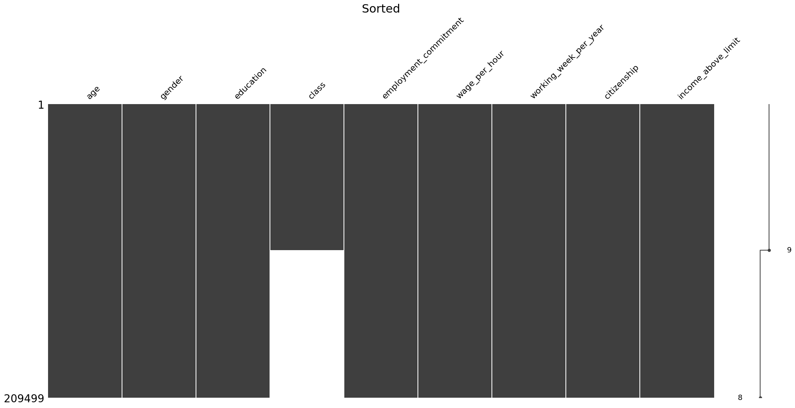
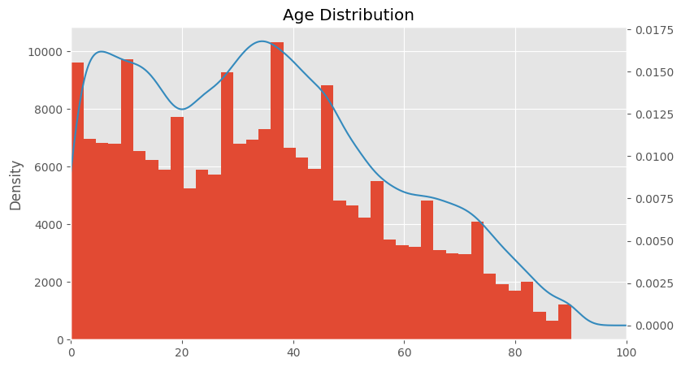

# Analysis on Income Predication Data Set

Author: Ephraim Sun, Jadon Swearingen, Adeeb-AbdulTaher

### Business Understanding

The purpose of the Income Prediction DataSet provided by Zindi is to analyze and classify if a person earns more or less than \$50,000 based on various data variables. Specifically, we are given a random population of over 100,000 individuals to test on 200,000 training data. The data is collected from a random American population where the media income was about $50,000 and is provided by the company Zindi. Third parties like Zindi are interested because they will use the machine learning algorithm to classify further individuals and people, giving them a score based on these model accuracy. Furthermore, third parties can use this data in applications like Finance (credit scoring and loans, fraud detection), Healthcare (health insurance and healthcare programs), as well as other areas like HR and Public Policy. The current predicition algorithm that will be considered useful to other parties is that it must be better than 96%, which another person has achieved.

### Data Understanding

#### Data Types

We have a large dataset with 42 variables. Therefore, we have decided to narrow down to 10 specific data sets that our team finds valuable along wih its corresponding data variable

| Variable    | Data Type | Description | 
| -------- | ------- | ------- |
| Age  |  Integer (int64)   | The age of the individual | 
| Gender |  Categorical (object)(object)    | If they are male or female
| Education    |  Categorical (object)   | What level of education they are in: high school, children, some college but no degree, bachelors degree(BA, AB, BS), 7th and 8th grade
| Class   |  Categorical (object)  | This is type of of employment of the individual, which includes private, Self-employed-not incorportated, Local government, State government, Self-employed-incorporated, etc
| Employment Commitment    |  Categorical (object)  | This is the employment Status of the individual: Children or Amred Forces, Full-time schedules, Not in labor force, PT for non-econ reasons usually FT, Umeployed full-time, 
| Citizenship    |  Categorical (object)  | What is citizenship status in regards to the United States: Native, Foreign born - Not a citizen of US, Foreign born - US citizen by naturalization, Native - Born abroad of American Parents, Native - Born in Puerto Rice or US Outlying
| Wage per hour    |  Integer (int64)  | How much they make per hour
| Working_week_per_year   |  Integer (int64)   | How many weeks per year they work (0- 52)
| income_above_limit   |  Categorical (object)  | Is the person above or below 50,000

#### Data Quality

Entries chosen that are missing data: Class

Many of our columns has missing values. For example, "Class," which we chose to include in our analysis, has only 50% non-null values (104254 out of 209499) meaning there are 105245 values that are null. These quality issues exists because some people don't want to include their class when filling out surveys. We deal with this by eliminating all of these rows that don't have class, because 50% is too much to impute. We could have tried to use nearest neighbor imputation or split-combine-impute, but this would likely skew the results. Many other columns had similar issues, but we decided that they had little impact on the income predictor and so decided to eliminate the entire columns and to choose the 9 most likely to influence the income.

### Data Visualization
[2 points] Visualize basic feature distributions. That is, plot the dynamic range and exploratory distribution plots (like boxplots, histograms, kernel density estimation) to better understand the data. Describe anything meaningful or potentially useful you discover from these visualizations. These may also help to understand what data is missing or needs imputation. Note: You can also use data from other sources to bolster visualizations. Visualize at least five plots, at least one categorical. 

We tried to explore the wage rate trends with respect to education and class at first, but we encountered some discrepancies in the data. which led us to implore ways to correct them. For example, using Wage Rate feature led to all self-employed people having 0 dollars per hour marked down, which isn't very intuitive at first, but further investigation led us to the conclusion that when people weren't paid hourly, they simply put down a 0 which made the graphs considerably skewed.  This made us reconsider using the wage rate for the final graphs without at least first imputing data. 

[2.5 points] Ask three interesting questions that are relevant to your dataset and explore visuals that help answer these questions. Use whichever visualization method is appropriate for your data.  Important: Interpret the implications for each visualization. 

Age Graph

